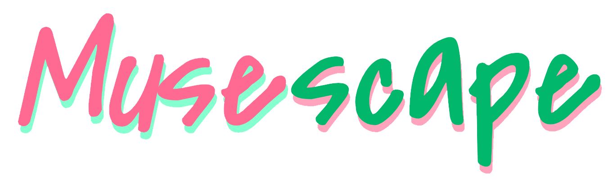

<h1 align=center>
  
</h1>

  <i align=center>Music discussion platform for music producers and enthusiasts alike. 🎵</i>

## Figma
[Musescape Figma File](https://www.figma.com/design/AjduVEWPQlGNqSNX8Bfqp9/Musescape?node-id=0-1&node-type=canvas&t=EhbzLtZBNd9FVSe9-0)

## Developers

[Gryphon Kumfert](https://github.com/GLKumfert)

[Tingxuan Wu](https://github.com/tingtingtingtingtingtingtingtingtingtin)

[Komay Sugiyama](https://github.com/zenxha)

[Andy Jarean](https://github.com/ajarean)

